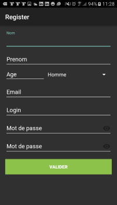
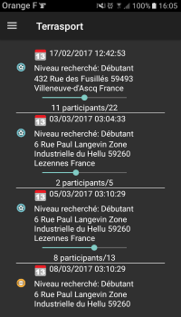
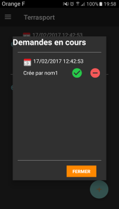
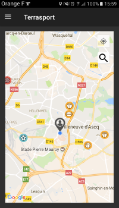
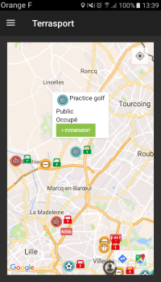
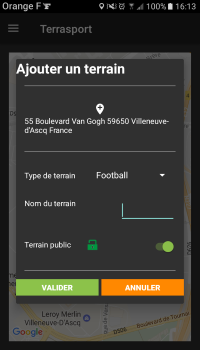
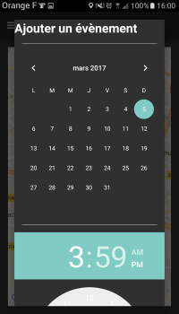
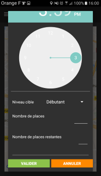

# Terrasport

Application Android qui permet de répertorier les terrains sportifs, d'en ajouter et de marquer des évènements sur ces terrains.

## Fonctionnalités de l'application

- Connexion
- Création d'un compte utilisateur
- Visualiser ses évènements, créer un évènement
- Demander à participer à un évènement sportif
- Refuser / Valider la demande de participation d'un utilisateur à un de ses évènements
- Visualiser l'ensemble des terrains sur la google map avec possibilité d'ajouter un terrain ou un évènement sur un terrain

## Screenshots de l'application

### Accueil

### Créer un compte

### Menu glissant de l'application

### Afficher la liste des évènements

### Afficher la liste des demandes de participation

### La google map qui affiche l'ensemble des terrains

### Visualiser le détail des informations sur un terrain

### Ajouter un terrain

### Ajouter un évènement sur un terrain

